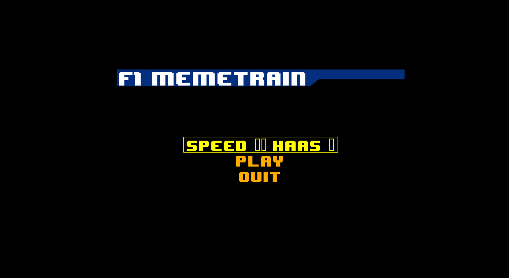

# Memetrain

## What is this?

I'm an avid F1 fan and I've been waiting for the new season to start. I'm also a big fan of memes. So I decided to combine the two and create an F1 meme inspired take of the popular game of snake. I've also wanted to play around with pygame for a while and this was an opportunity to give it a go...normally I build really serious stuff, like APIs and data pipelines, so this was a nice change...anyway, its silly, but I had fun building it. I hope you enjoy.


## Installation

### Windows

The easiest way to install the game is from itch.io. You can download the game from [here](https://naughtywasp.itch.io/memetrain).

On Windows 8.1 and onwards, when you launch the game it may show a warning like:
    "Windows protected your PC - Windows Defender SmartScreen prevented an 
    unrecognized app from starting. Running this app might put your PC at risk."
    
You can bypass this by clicking "more info" -> "Run Anyway" in the Windows popup.

This happens because I don't have a digital certificate, because they're hella expensive.

### Linux, mac, and other nerds

If you're not using Windows then I'm afraid you'll have to run the game from source code. Its not that hard, I promise:

1. You'll need to install python 3.8 or higher
2. You'll need to install poetry (https://python-poetry.org/docs/#installation)
3. You'll need to clone the repo and install the dependencies

```bash
git clone https://github.com/burtonrj/memetrain.git
cd memetrain
poetry install
```

4. You can then run the game with the following command:

```bash
poetry run python -m memetrain.py
```

## How to play

The game is pretty simple. You control the safety car with the arrow keys. The aim of the game is to collect memes and grow your train of F1 cars. Once you collect two of every team, you win!
What memes will you find...what adventures will you have. The possibilities are...limited, but still fun.

## Screenshots




## License

This project is licensed under the terms of the MIT license. See [LICENSE](LICENSE) for more details.
